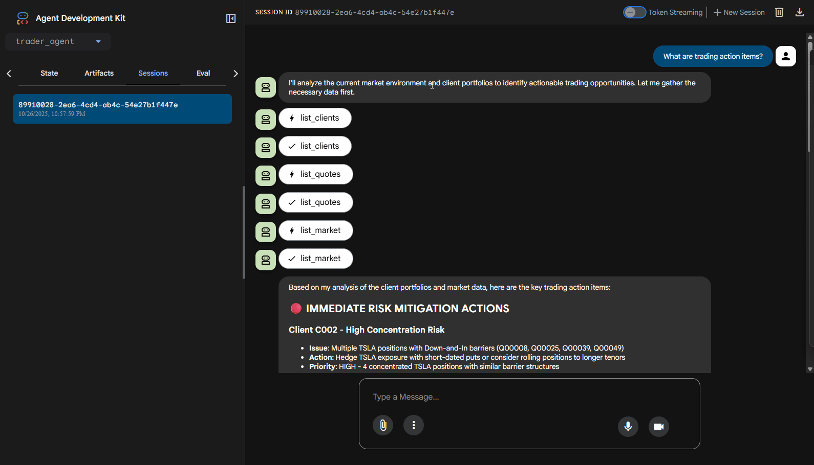

# Ascend AI ADK

Lightweight demonstration project that provides small MCP (Model Context Protocol) servers backed by a SQLite seed database. The repository contains example MCP modules for positions, clients, products, trades, quotes and market data. Each MCP module exposes structured (Pydantic) and unstructured outputs suitable for FastMCP-based tooling or simple direct imports for testing.

Quick overview
- data/init_db.py - seeds a local SQLite database at `data/positions.db` with tables: `positions`, `clients`, `trades`, `product`, `quote`, `market`.
- mcp/*.py - MCP modules for each table (position_mcp.py, clients_mcp.py, product_mcp.py, trades_mcp.py, quote_mcp.py, market_mcp.py). These export functions like `list_*` and `get_*` and a `mcp` FastMCP instance when `fastmcp` is installed.
- mcp/mcp_server_http.py - example Starlette + Uvicorn app that mounts multiple FastMCP streamable HTTP apps.
- agents/ - example agent and config (uses Google ADK placeholders).

Goal
Provide a minimal, runnable local environment so developers can:
- seed a demo database
- inspect and call MCP functions directly from Python
- run a FastMCP + Starlette HTTP server to expose the MCP endpoints

Requirements
- Python 3.10+ (project was tested on 3.13 in the workspace)
- Node.js + npm (optional; some dev tools or frontends may need npm)

Python dependencies
Install the Python dependencies into a virtual environment. We include the minimal list in `requirements.txt`.

Create and activate a venv (PowerShell):
```powershell
python -m venv .venv
; .\.venv\Scripts\Activate.ps1
python -m pip install --upgrade pip
pip install -r requirements.txt
```

Seed the database
```powershell
python data/init_db.py
```
This creates `data/positions.db` and prints a confirmation message.

Run the example FastMCP HTTP server (recommended)
This project uses `fastmcp` to expose streamable HTTP endpoints. Start the Starlette app using Uvicorn from the repository root:
```powershell
python mcp\mcp_server_http.py
```
When running, the example app mounts the MCP apps at the following prefixes:
- /client
- /position
- /quote
- /market
- /trades
- /product

You can curl the root health endpoint:
```powershell
curl http://127.0.0.1:8003/
```

Call MCP functions directly (no FastMCP required)
Each module is importable and its helper functions can be called directly. Examples:
```powershell
python - <<'PY'
from mcp.position_mcp import list_positions, get_position
print(list_positions(limit=2).dict())
print(get_position(1).dict() if get_position(1) else 'not found')
PY
```

Test with MCP Inspector:
For a simple test of the MCP servers without FastMCP, you can run the test HTTP server:
```powershell
python mcp/mcp_http_server_test.py
```
This starts a basic HTTP server on port 8000 that exposes the MCP functions.

To visually inspect and test the MCP servers, you can use the MCP Inspector tool:

1. First, ensure you have Node.js and npm installed
2. Run the MCP Inspector:
```powershell
npx @modelcontextprotocol/inspector
```
This will open the MCP Inspector in your default browser. By default, it connects to `http://localhost:8000`.

3. In the Inspector:
   - Click "Add Connection" to add a new MCP server connection
   - Enter the URL of your running MCP server (e.g., `http://localhost:8000` for the test server or `http://localhost:8003` for the FastMCP server)
   - You can now browse and test all available MCP functions through the Inspector interface

-
Sample usage (ADK Web)



Figure: showing a trader manager agent and interaction with MCP functions (animated GIF) through ADK Web


Figure: showing a sales manager agent and interaction with MCP functions (animated GIF) through ADK Web


Notes and tips
- The code is intentionally permissive: if `fastmcp` isn't installed the modules still export callable functions so you can test logic without the server runtime.
- The MCP modules use Pydantic models for structured returns. If you decorate a function with `@mcp.tool()` and it returns an arbitrary untyped class, Pydantic will attempt to generate a schema and fail. The modules return raw dicts for untyped/unstructured responses to avoid that problem.


