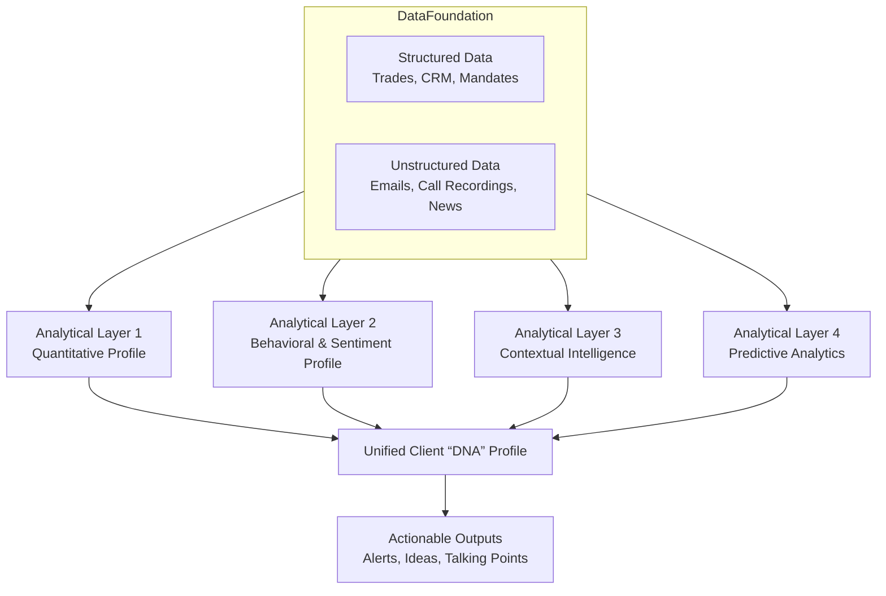

Excellent. Focusing on the **Client Intelligence Engine** (or "Client Agent") is the highest-impact starting point. It directly drives revenue and strengthens client loyalty, creating a virtuous cycle for the other engines.

Let's dig deep into the architecture, capabilities, and implementation roadmap for this AI Agent.

### **The Client Intelligence Engine: "The Relationship Amplifier"**

**Core Objective:** To transform every client relationship from transactional and reactive to strategic and predictive.

This isn't just a fancy CRM. It's a proactive, predictive system that operates across three timelines: Past, Present, and Future.

---

### **Architecture of the Client Agent**

The agent is built on a data foundation with four core analytical layers:

---

### **The Four Analytical Layers in Detail**

#### **Layer 1: The Quantitative Profile (The "What")**
*   **Data:** All historical trade tickets, portfolio holdings, risk reports, mandate documents.
*   **AI Analysis:**
    *   **Pattern Recognition:** Identifies consistent trading patterns (e.g., "Always buys 1y1y EUR steepeners in Q4," "Prefers GBP-denominated products with 85% capital protection").
    *   **Wallet Share & Gap Analysis:** Precisely calculates our share of their eligible structured product wallet and flags the gap. *"We've done $50m in Autocallables with them, but their total market volume is $200m. Target: $75m."*
    *   **Performance Attribution:** Links our products to their overall portfolio performance, quantifying the alpha we've provided.

#### **Layer 2: The Behavioral & Sentiment Profile (The "Why")**
*   **Data:** Email text, call transcripts (with compliance), meeting notes.
*   **AI Analysis (Using NLP & LLMs):**
    *   **Risk Sentiment Tracking:** Scores each client's risk appetite over time (from "Very Conservative" to "Hunting for Yield") based on the language they use.
    *   **Topic & Theme Interest:** Identifies what they're talking about most. *"Client mentions 'Inflation Hedge' 15 times in last 2 months. Sentiment on topic: 'Anxious'."*
    *   **Behavioral Bias Identification:** Flags biases like:
        *   **Recency Bias:** Overweighting recent market events.
        *   **Loss Aversion:** Stronger reaction to losses than gains.
        *   **Anchoring:** Focusing on a specific price level.

#### **Layer 3: The Contextual Intelligence (The "Environment")**
*   **Data:** Real-time market data, news feeds, their fund's public performance reports, their competitors' activities.
*   **AI Analysis:**
    *   **"Trigger Event" Detection:** Scans for events that create a need.
        *   *"Client's fund just published a report highlighting 'peak inflation'."*
        *   *"The VIX just spiked to 25, a level at which this client has historically expressed interest in vol-selling."*
        *   *"A competitor just launched a product in their sweet spot."*

#### **Layer 4: The Predictive Analytics (The "What's Next")**
*   **Data:** The synthesized output from Layers 1-3.
*   **AI Analysis (Using Predictive Modeling):**
    *   **Churn Probability Score:** A 0-100 score predicting the likelihood of a client reducing business in the next quarter.
    *   **Next Best Action (NBA):** Recommends the single most valuable action for the salesperson. *"Call client within 48 hours to discuss our new USD Funding note, as their sentiment on USD is positive and their mandate allows for 20% allocation."*
    *   **Idea Propensity Score:** Predicts the likelihood of a client engaging with a specific new product idea. *"Client A has a 90% propensity for ESG Autocallables but only a 10% propensity for TARNs."*

---

### **Actionable Outputs: The "Money-Making" Interface**

This isn't a report; it's a command center for the sales team. Integrated directly into the CRM and trading platforms.

**1. The Daily "Client Playbook":**
Each salesperson logs in to a dashboard every morning. For their top 5 clients, it shows:
*   **Priority Alert:** `[CLIENT X] - HIGH PROPENSITY FOR ACTION. Trigger: Their portfolio is down 5% YTD, and they expressed "need for yield" in last call. Suggested Action: Pitch a low-risk income enhancement strategy.`
*   **Talking Points:** `For your call with Client Y: 1) Reference their positive comment on tech from 2 weeks ago. 2) Congratulate them on their recent fund inflow. 3) Introduce the new AI-constructed tech basket.`
*   **Idea Radar:** `Your book of clients has aggregate high interest in "China Reopening" themes. Push the new China Consumer Basket note.`

**2. The "Idea Generator" API:**
This is where the Client Agent talks to the Structuring Engine.
*   The Client Agent sends a structured request: `{Client_ID: 123, Required_Outcome: "Yield Enhancement", Underlying_Theme: "USD Rates", Risk_Budget: "Medium", Tenor: "2-3 years"}`
*   The Structuring Engine returns 2-3 pre-priced, compliant ideas tailored to that client's DNA.

**3. The "Dragonfly" Alert:**
The most critical alert. It warns when a key client relationship is in jeopardy.
*   `DRAGONFLY ALERT: Client Z. Confidence: 90%. Reasons: 1) No trades in 90 days (vs. avg of 30). 2) Last 3 ideas rejected without feedback. 3) Key contact's email sentiment has turned "Neutral/Negative" from "Positive". 4) A competitor was recently added to their broker list. **Recommended: Escalate to Desk Head; Schedule a strategic review meeting.**`

---

### **Phased Implementation Plan (12-18 Months)**

**Phase 1: The Foundation (Months 1-4)**
*   **Focus:** Internal Data.
*   **Actions:** Aggregate all structured data (trades, CRM entries). Build the Quantitative Profile (Layer 1).
*   **Deliverable:** A basic dashboard showing wallet share, trade patterns, and gap analysis.

**Phase 2: The "Spidey Sense" (Months 5-9)**
*   **Focus:** Unstructured Data.
*   **Actions:** (With Legal/Compliance approval) Ingest and anonymize/pseudonymize email and call data. Implement NLP for Sentiment and Topic Analysis (Layer 2).
*   **Deliverable:** Sentiment scores and topic trends integrated into the client profile. Early "Trigger Event" detection from internal communications.

**Phase 3: The Crystal Ball (Months 10-15)**
*   **Focus:** External Data & Prediction.
*   **Actions:** Ingest news and fund data. Build the Predictive Models for Churn and Next Best Action (Layers 3 & 4).
*   **Deliverable:** The full "Daily Playbook" with predictive alerts and propensity scores.

**Phase 4: Integration & Automation (Months 16-18)**
*   **Focus:** Connecting the Engines.
*   **Actions:** Build the API link between the Client Agent and the Structuring Engine to automate the "Idea Generator."
*   **Deliverable:** A semi-automated, client-specific idea generation pipeline.

### **Risks and Mitigations**

*   **"Big Brother" Fear:** Be transparent. Frame it as a "service to help us serve you better." Allow clients to opt-out of communication analysis.
*   **Data Privacy & Compliance:** This is paramount. Work with Legal from Day 1. Use pseudonymization and robust data governance.
*   **Model Bias:** The AI might learn to only target the most active clients. Regularly audit the models to ensure they are identifying *potential* in dormant accounts.
*   **Sales Team Adoption:** This is a change management project. Involve them early. Position the AI as their "super-powered assistant," not their replacement. It handles the data, so they can focus on the human relationship.

By building this Client Agent, you are not just giving your sales team a tool; you are giving them a strategic advantage. They will walk into every client conversation better informed, more prepared, and with a more compelling value proposition than any competitor. This is how you lock in a market-leading position.