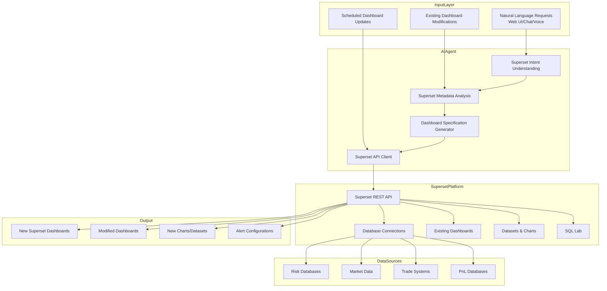

Absolutely! Integrating with Apache Superset is a brilliant approach. Instead of building a separate dashboard system, we can leverage Superset's robust platform and have the AI agent act as a "co-pilot" for Superset operations. This gives us the best of both worlds: Superset's mature visualization capabilities and the AI's natural language interface.

## Superset-Integrated AI Agent Architecture

### System Architecture



## Technical Implementation

### 1. Superset-Specific Intent Understanding

```python
class SupersetIntentUnderstanding:
    def __init__(self, superset_client):
        self.superset_client = superset_client
        self.llm = self.load_fine_tuned_llm()
        
    def parse_superset_request(self, natural_language: str, context: Dict = None) -> Dict:
        """Parse trader request into Superset-specific actions"""
        
        # Get existing Superset metadata for context
        existing_assets = self.get_relevant_superset_assets(natural_language)
        
        structured_request = self.llm.analyze_superset_request(
            request=natural_language,
            existing_dashboards=existing_assets['dashboards'],
            existing_datasets=existing_assets['datasets'],
            existing_charts=existing_assets['charts']
        )
        
        return {
            'action_type': structured_request['action'],  # create_dashboard, modify_dashboard, add_chart, etc.
            'target_dashboard': structured_request.get('dashboard_name'),
            'chart_specifications': structured_request.get('charts', []),
            'data_sources': structured_request.get('data_sources', []),
            'layout_preferences': structured_request.get('layout', {}),
            'filters': structured_request.get('filters', [])
        }
    
    def get_relevant_superset_assets(self, query: str) -> Dict:
        """Find existing Superset assets relevant to the request"""
        all_dashboards = self.superset_client.get_dashboards()
        all_datasets = self.superset_client.get_datasets()
        
        # Use semantic search to find relevant assets
        relevant_dashboards = self.semantic_search_dashboards(query, all_dashboards)
        relevant_datasets = self.semantic_search_datasets(query, all_datasets)
        
        return {
            'dashboards': relevant_dashboards,
            'datasets': relevant_datasets,
            'charts': self.find_charts_for_datasets(relevant_datasets)
        }
```

### 2. Superset API Client

```python
class SupersetAPIClient:
    def __init__(self, base_url: str, username: str, password: str):
        self.base_url = base_url
        self.session = self.authenticate(username, password)
        self.csrf_token = self.get_csrf_token()
    
    def authenticate(self, username: str, password: str) -> requests.Session:
        """Authenticate with Superset"""
        session = requests.Session()
        auth_payload = {
            "username": username,
            "password": password,
            "provider": "db"
        }
        
        response = session.post(f"{self.base_url}/api/v1/security/login", json=auth_payload)
        response.raise_for_status()
        
        auth_data = response.json()
        session.headers.update({
            "Authorization": f"Bearer {auth_data['access_token']}",
            "Content-Type": "application/json"
        })
        
        return session
    
    # Dashboard Operations
    def create_dashboard(self, dashboard_spec: Dict) -> Dict:
        """Create a new dashboard in Superset"""
        response = self.session.post(
            f"{self.base_url}/api/v1/dashboard",
            json=dashboard_spec
        )
        response.raise_for_status()
        return response.json()
    
    def get_dashboard(self, dashboard_id: int) -> Dict:
        """Get dashboard details"""
        response = self.session.get(f"{self.base_url}/api/v1/dashboard/{dashboard_id}")
        response.raise_for_status()
        return response.json()
    
    def update_dashboard(self, dashboard_id: int, updates: Dict) -> Dict:
        """Update an existing dashboard"""
        response = self.session.put(
            f"{self.base_url}/api/v1/dashboard/{dashboard_id}",
            json=updates
        )
        response.raise_for_status()
        return response.json()
    
    # Chart Operations
    def create_chart(self, chart_spec: Dict) -> Dict:
        """Create a new chart"""
        response = self.session.post(
            f"{self.base_url}/api/v1/chart",
            json=chart_spec
        )
        response.raise_for_status()
        return response.json()
    
    def add_chart_to_dashboard(self, dashboard_id: int, chart_id: int, position: Dict) -> bool:
        """Add a chart to a dashboard at specific position"""
        dashboard = self.get_dashboard(dashboard_id)
        
        # Update dashboard position data
        position_data = dashboard.get('position_json', {})
        position_data[str(chart_id)] = position
        
        update_payload = {
            "position_json": position_data
        }
        
        response = self.session.put(
            f"{self.base_url}/api/v1/dashboard/{dashboard_id}",
            json=update_payload
        )
        
        return response.status_code == 200
    
    # Dataset Operations
    def get_datasets(self) -> List[Dict]:
        """Get all available datasets"""
        response = self.session.get(f"{self.base_url}/api/v1/dataset")
        response.raise_for_status()
        return response.json()['result']
    
    def create_dataset(self, dataset_spec: Dict) -> Dict:
        """Create a new dataset"""
        response = self.session.post(
            f"{self.base_url}/api/v1/dataset",
            json=dataset_spec
        )
        response.raise_for_status()
        return response.json()
```

### 3. Superset Specification Generator

```python
class SupersetSpecificationGenerator:
    def __init__(self, superset_client):
        self.client = superset_client
    
    def generate_dashboard_spec(self, intent: Dict) -> Dict:
        """Generate Superset dashboard specification from intent"""
        
        dashboard_spec = {
            "dashboard_title": intent.get('dashboard_title', 'AI-Generated Dashboard'),
            "slug": self.generate_slug(intent['dashboard_title']),
            "position_json": self.generate_layout(intent.get('chart_specifications', [])),
            "css": "",
            "json_metadata": {
                "timed_refresh_immune_slices": [],
                "expanded_slices": {},
                "filter_scopes": self.generate_filter_scopes(intent.get('filters', [])),
                "chart_configuration": {},
                "color_scheme": "supersetColors",
                "label_colors": {},
                "shared_label_colors": {}
            },
            "published": True
        }
        
        return dashboard_spec
    
    def generate_chart_spec(self, chart_intent: Dict, dataset_id: int) -> Dict:
        """Generate Superset chart specification"""
        
        viz_type = self.map_visualization_type(chart_intent['chart_type'])
        metrics = self.generate_metrics(chart_intent['metrics'])
        groupby = chart_intent.get('dimensions', [])
        
        chart_spec = {
            "slice_name": chart_intent['title'],
            "viz_type": viz_type,
            "params": {
                "datasource": f"{dataset_id}__table",
                "viz_type": viz_type,
                "time_range": self.map_time_range(chart_intent.get('time_window')),
                "metrics": metrics,
                "groupby": groupby,
                "adhoc_filters": self.generate_filters(chart_intent.get('filters', [])),
                "row_limit": 10000,
                "color_scheme": "supersetColors",
                "label_colors": {}
            },
            "query_context": self.generate_query_context(dataset_id, chart_intent),
            "datasource_id": dataset_id,
            "datasource_type": "table"
        }
        
        return chart_spec
    
    def map_visualization_type(self, chart_type: str) -> str:
        """Map natural language chart types to Superset visualization types"""
        mapping = {
            'line_chart': 'line',
            'bar_chart': 'bar',
            'pie_chart': 'pie',
            'area_chart': 'area',
            'table': 'table',
            'heatmap': 'heatmap',
            'scatter_plot': 'scatter',
            'bubble_chart': 'bubble',
            'big_number': 'big_number',
            'big_number_total': 'big_number_total',
            'treemap': 'treemap'
        }
        return mapping.get(chart_type, 'table')
    
    def generate_metrics(self, metrics: List[str]) -> List[Dict]:
        """Generate Superset metrics configuration"""
        superset_metrics = []
        
        for metric in metrics:
            if metric == 'count':
                superset_metrics.append({"label": "COUNT(*)", "expression": "COUNT(*)"})
            else:
                superset_metrics.append({
                    "expressionType": "SIMPLE",
                    "column": {"column_name": metric},
                    "aggregate": "SUM",
                    "label": f"SUM({metric})"
                })
        
        return superset_metrics
    
    def generate_layout(self, charts: List[Dict]) -> Dict:
        """Generate dashboard layout using Superset's grid system"""
        layout = {}
        
        # Simple grid layout - can be made more sophisticated
        for i, chart in enumerate(charts):
            layout[str(chart['temp_id'])] = {
                "type": "CHART",
                "id": chart['temp_id'],
                "children": [],
                "meta": {
                    "chartId": chart['temp_id'],
                    "width": chart.get('width', 4),
                    "height": chart.get('height', 4)
                },
                "parents": ["ROOT_ID", "GRID_ID"],
                "id": str(chart['temp_id'])
            }
        
        return layout
```

### 4. Complete Superset Integration Agent

```python
class SupersetAIAgent:
    def __init__(self, superset_url: str, username: str, password: str):
        self.superset_client = SupersetAPIClient(superset_url, username, password)
        self.intent_understanding = SupersetIntentUnderstanding(self.superset_client)
        self.spec_generator = SupersetSpecificationGenerator(self.superset_client)
        
    async def handle_trader_request(self, natural_language: str, trader_context: Dict = None) -> Dict:
        """Main entry point for trader requests"""
        
        try:
            # Step 1: Parse intent with Superset context
            print("🔍 Understanding Superset request...")
            intent = self.intent_understanding.parse_superset_request(
                natural_language, 
                trader_context
            )
            
            # Step 2: Execute the appropriate action
            if intent['action_type'] == 'create_dashboard':
                result = await self.create_new_dashboard(intent)
            elif intent['action_type'] == 'modify_dashboard':
                result = await self.modify_existing_dashboard(intent)
            elif intent['action_type'] == 'add_chart':
                result = await self.add_chart_to_dashboard(intent)
            elif intent['action_type'] == 'create_dataset':
                result = await self.create_new_dataset(intent)
            else:
                result = await self.handle_custom_action(intent)
            
            # Step 3: Return Superset URLs for immediate access
            result['superset_urls'] = self.generate_superset_urls(result)
            
            return result
            
        except Exception as e:
            return self.handle_error(e, natural_language)
    
    async def create_new_dashboard(self, intent: Dict) -> Dict:
        """Create a complete new dashboard in Superset"""
        
        # Step 1: Ensure datasets exist or create them
        dataset_ids = []
        for data_source in intent['data_sources']:
            dataset_id = await self.ensure_dataset_exists(data_source)
            dataset_ids.append(dataset_id)
        
        # Step 2: Create charts
        chart_ids = []
        for chart_spec in intent['chart_specifications']:
            # Find appropriate dataset for this chart
            dataset_id = self.find_matching_dataset(chart_spec, dataset_ids)
            
            # Generate Superset chart specification
            superset_chart_spec = self.spec_generator.generate_chart_spec(chart_spec, dataset_id)
            
            # Create chart in Superset
            chart_result = self.superset_client.create_chart(superset_chart_spec)
            chart_ids.append(chart_result['id'])
        
        # Step 3: Create dashboard
        dashboard_spec = self.spec_generator.generate_dashboard_spec(intent)
        dashboard_result = self.superset_client.create_dashboard(dashboard_spec)
        
        # Step 4: Add charts to dashboard
        for i, chart_id in enumerate(chart_ids):
            position = self.calculate_chart_position(i, len(chart_ids))
            self.superset_client.add_chart_to_dashboard(dashboard_result['id'], chart_id, position)
        
        return {
            'action': 'dashboard_created',
            'dashboard_id': dashboard_result['id'],
            'dashboard_title': dashboard_result['dashboard_title'],
            'chart_count': len(chart_ids),
            'dataset_count': len(dataset_ids)
        }
    
    async def modify_existing_dashboard(self, intent: Dict) -> Dict:
        """Modify an existing Superset dashboard"""
        
        target_dashboard = intent['target_dashboard']
        dashboard_info = self.find_dashboard_by_name(target_dashboard)
        
        if not dashboard_info:
            return await self.handle_dashboard_not_found(target_dashboard, intent)
        
        # Get current dashboard state
        current_dashboard = self.superset_client.get_dashboard(dashboard_info['id'])
        
        # Apply modifications
        modifications = self.generate_modifications(intent, current_dashboard)
        updated_dashboard = self.superset_client.update_dashboard(
            dashboard_info['id'], 
            modifications
        )
        
        return {
            'action': 'dashboard_modified',
            'dashboard_id': dashboard_info['id'],
            'modifications_applied': len(modifications),
            'previous_version': current_dashboard['version']
        }
```

### 5. Real-World Usage Examples

```python
# Example 1: Create a new risk dashboard
def example_risk_dashboard():
    trader_request = """
    Create a new Superset dashboard called "Barrier Options Risk Monitor" with:
    - Line chart showing delta exposure by underlying for the last week
    - Heatmap of vega by maturity bucket
    - Big number total showing current VAR
    - Table with top 10 positions by gamma
    Use the "risk_metrics" dataset and refresh every 5 minutes
    """
    
    agent = SupersetAIAgent('https://superset.company.com', 'ai_agent', 'password')
    result = await agent.handle_trader_request(trader_request)
    
    # Returns:
    # {
    #   'action': 'dashboard_created',
    #   'dashboard_id': 42,
    #   'dashboard_title': 'Barrier Options Risk Monitor',
    #   'superset_urls': {
    #     'dashboard': 'https://superset.company.com/superset/dashboard/42/',
    #     'edit': 'https://superset.company.com/superset/dashboard/42/edit'
    #   }
    # }

# Example 2: Modify existing dashboard
def example_modify_dashboard():
    trader_request = """
    Add a volatility surface chart to my "Autocallable Monitoring" dashboard.
    Show 1M, 3M, 6M implied volatility for SPX and compare to historical average.
    Use the "volatility_data" dataset.
    """
    
    result = await agent.handle_trader_request(trader_request)
    
    # Agent will:
    # 1. Find the "Autocallable Monitoring" dashboard
    # 2. Create a new volatility surface chart
    # 3. Add it to the dashboard with appropriate layout
    # 4. Return the updated dashboard URL

# Example 3: Dataset creation and chart addition
def example_dataset_creation():
    trader_request = """
    I have a new PostgreSQL table called "overnight_risk_changes" with columns:
    timestamp, product_type, underlying, delta_change, vega_change, pnl_impact
    Create a dataset in Superset for this table and make a bar chart showing
    average delta_change by product_type for the last month.
    Add this chart to my "Morning Risk Report" dashboard.
    """
    
    result = await agent.handle_trader_request(trader_request)
```

### 6. Advanced Superset Features Integration

```python
class AdvancedSupersetFeatures:
    def implement_alerts(self):
        """Configure Superset alerts based on natural language"""
        
        alert_requests = {
            "Alert me when VAR exceeds $10M": {
                'action': 'create_alert',
                'chart': 'var_monitor_chart',
                'condition': 'value > 10000000',
                'notification': 'email+slack'
            },
            "Notify if correlation drops below 0.7": {
                'action': 'create_alert', 
                'chart': 'correlation_matrix',
                'condition': 'value < 0.7',
                'notification': 'mobile_push'
            }
        }
    
    def handle_cross_filtering(self):
        """Set up cross-filtering between charts"""
        
        cross_filter_requests = {
            "Make the underlying selection filter all charts": 
                "Configure dashboard-level filters for underlying",
            
            "When I click on a bar in the product type chart, filter the risk heatmap":
                "Set up chart-to-chart filtering"
        }
    
    def implement_scheduled_reports(self):
        """Set up scheduled PDF reports"""
        
        report_requests = {
            "Email me a PDF of the morning risk dashboard every day at 8 AM":
                "Create scheduled report for risk dashboard",
            
            "Send weekly PnL report to the management team every Friday 6 PM":
                "Create weekly scheduled report with specific recipients"
        }
```

## Benefits of Superset Integration

1. **Leverage Existing Investment**: Use your current Superset infrastructure
2. **Enterprise Features**: Alerts, security, scheduling already built-in
3. **No New Infrastructure**: No additional servers or maintenance
4. **Familiar Interface**: Traders already know how to use Superset
5. **Collaboration**: Built-in sharing and permissions
6. **Mobile Support**: Superset mobile app works out of the box

This approach gives traders the power of natural language dashboard creation while maintaining all the enterprise features and scalability of Apache Superset. The AI agent becomes a productivity multiplier rather than a replacement for existing tools.