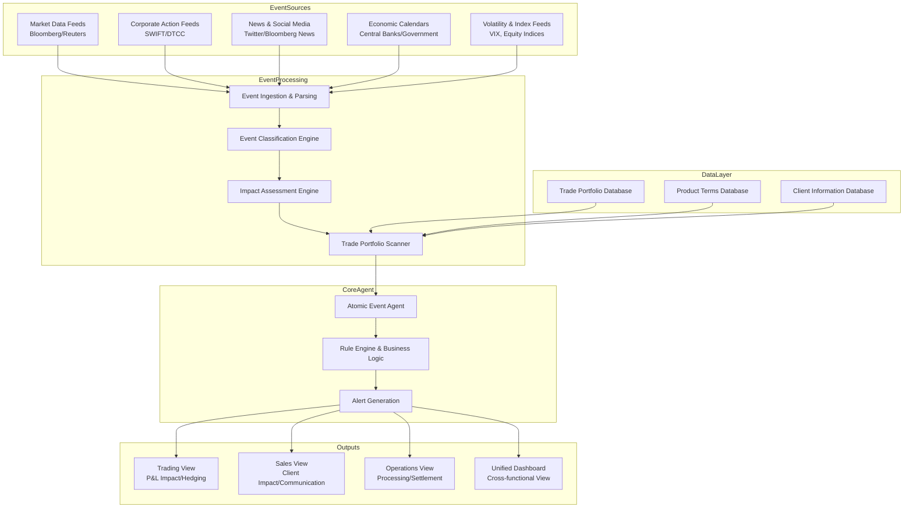

Excellent. This is a critical requirement for structured products where corporate actions and market events can trigger significant P&L impacts, operational workloads, and client relationship issues. Let's design an **Atomic Event Monitoring Agent** that serves as the central nervous system for event-driven risk management.

## System Architecture: Atomic Event Monitoring Agent

### Core Design Principles

1. **Atomicity**: Each event is processed independently and completely
2. **Real-time Processing**: Sub-second detection to notification
3. **Multi-perspective Views**: Tailored alerts for Trading, Sales, Operations
4. **Actionable Intelligence**: Not just alerts, but specific impacted trades and required actions

### System Architecture



## Technical Implementation

### 1. Event Classification Engine

```python
class EventClassifier:
    def __init__(self):
        self.event_types = {
            'corporate_actions': ['MERGERS', 'SPINOFFS', 'DIVIDENDS', 'SPLITS', 'TENDER_OFFERS'],
            'market_events': ['MARKET_HALTS', 'CIRCUIT_BREAKERS', 'VOLATILITY_SPIKES', 'LIQUIDITY_CRISES'],
            'economic_events': ['RATE_DECISIONS', 'JOBS_REPORTS', 'INFLATION_DATA', 'GEOPOLITICAL_EVENTS'],
            'underlying_specific': ['EARNINGS_ANNOUNCEMENTS', 'GUIDANCE_CHANGES', 'SECTOR_NEWS']
        }
    
    def classify_event(self, raw_event):
        """Parse and classify incoming events"""
        event = {
            'event_id': self.generate_event_id(),
            'timestamp': raw_event['timestamp'],
            'source': raw_event['source'],
            'raw_data': raw_event,
            'classification': None,
            'severity': 'LOW',  # LOW, MEDIUM, HIGH, CRITICAL
            'confidence': 0.0
        }
        
        # NLP-based classification for news events
        if 'headline' in raw_event:
            event.update(self.classify_news_event(raw_event['headline']))
        
        # Structured data classification for corporate actions
        elif 'action_type' in raw_event:
            event.update(self.classify_corporate_action(raw_event))
        
        # Market data pattern detection
        elif 'price_data' in raw_event:
            event.update(self.detect_market_events(raw_event))
        
        return event
    
    def classify_news_event(self, headline):
        """Use NLP to classify news events"""
        categories = {
            'MERGER': ['merge', 'acquisition', 'takeover', 'buyout'],
            'DIVIDEND': ['dividend', 'payout', 'distribution'],
            'EARNINGS': ['earnings', 'profit', 'loss', 'quarterly results'],
            'GUIDANCE': ['guidance', 'forecast', 'outlook'],
            'REGULATORY': ['regulation', 'investigation', 'lawsuit', 'settlement']
        }
        
        classification = {}
        headline_lower = headline.lower()
        
        for category, keywords in categories.items():
            if any(keyword in headline_lower for keyword in keywords):
                classification['classification'] = category
                classification['confidence'] = 0.8
                break
        
        return classification
```

### 2. Impact Assessment Engine

```python
class ImpactAssessmentEngine:
    def __init__(self, trade_db, product_terms_db):
        self.trade_db = trade_db
        self.product_terms_db = product_terms_db
        self.impact_rules = self.load_impact_rules()
    
    def assess_event_impact(self, event, underlying_asset):
        """Determine which trades are impacted by event"""
        
        # Get all trades for the underlying asset
        asset_trades = self.trade_db.get_trades_by_underlying(underlying_asset)
        
        impacted_trades = []
        
        for trade in asset_trades:
            impact_analysis = self.analyze_trade_impact(trade, event)
            if impact_analysis['is_impacted']:
                impacted_trades.append({
                    'trade': trade,
                    'impact_analysis': impact_analysis,
                    'required_actions': self.determine_required_actions(trade, event, impact_analysis)
                })
        
        return impacted_trades
    
    def analyze_trade_impact(self, trade, event):
        """Detailed impact analysis for a specific trade"""
        
        impact = {
            'is_impacted': False,
            'impact_type': None,
            'pnl_impact_estimate': 0.0,
            'risk_metrics_change': {},
            'barrier_status_change': None,
            'coupon_impact': None
        }
        
        product_type = trade['product_type']
        event_type = event['classification']
        
        # Barrier monitoring for market events
        if event_type in ['VOLATILITY_SPIKES', 'MARKET_HALTS']:
            barrier_impact = self.assess_barrier_impact(trade, event)
            if barrier_impact:
                impact.update(barrier_impact)
                impact['is_impacted'] = True
        
        # Corporate action impacts
        elif event_type in ['DIVIDENDS', 'SPLITS', 'MERGERS']:
            corp_action_impact = self.assess_corporate_action_impact(trade, event)
            if corp_action_impact:
                impact.update(corp_action_impact)
                impact['is_impacted'] = True
        
        # Early termination triggers
        elif event_type in ['EARNINGS_ANNOUNCEMENTS', 'GUIDANCE_CHANGES']:
            early_term_impact = self.assess_early_termination_risk(trade, event)
            if early_term_impact:
                impact.update(early_term_impact)
                impact['is_impacted'] = True
        
        return impact
    
    def assess_barrier_impact(self, trade, event):
        """Check if event triggers barrier levels"""
        if 'barrier_level' not in trade:
            return None
        
        current_price = event['raw_data'].get('current_price')
        barrier_level = trade['barrier_level']
        barrier_type = trade.get('barrier_type', 'KNOCK_IN')  # KNOCK_IN, KNOCK_OUT
        
        if current_price:
            if barrier_type == 'KNOCK_IN' and current_price <= barrier_level:
                return {
                    'impact_type': 'BARRIER_TRIGGERED',
                    'barrier_status_change': 'KNOCKED_IN',
                    'pnl_impact_estimate': self.calculate_knockin_impact(trade),
                    'message': f"Barrier triggered at {barrier_level}, current price {current_price}"
                }
            elif barrier_type == 'KNOCK_OUT' and current_price >= barrier_level:
                return {
                    'impact_type': 'BARRIER_TRIGGERED', 
                    'barrier_status_change': 'KNOCKED_OUT',
                    'pnl_impact_estimate': self.calculate_knockout_impact(trade),
                    'message': f"Knock-out triggered at {barrier_level}, current price {current_price}"
                }
        
        return None
```

### 3. Multi-Team Alert Generation

```python
class MultiTeamAlertGenerator:
    def __init__(self):
        self.team_views = {
            'trading': TradingView(),
            'sales': SalesView(), 
            'operations': OperationsView()
        }
    
    def generate_alerts(self, event, impacted_trades):
        """Generate team-specific alerts"""
        
        alerts = {}
        
        # Trading Alerts (P&L, Risk, Hedging)
        alerts['trading'] = self.generate_trading_alerts(event, impacted_trades)
        
        # Sales Alerts (Client Communication, Relationship Management)
        alerts['sales'] = self.generate_sales_alerts(event, impacted_trades)
        
        # Operations Alerts (Processing, Settlement, Documentation)
        alerts['operations'] = self.generate_operations_alerts(event, impacted_trades)
        
        return alerts

class TradingView:
    def generate_alerts(self, event, impacted_trades):
        alerts = []
        
        for impacted in impacted_trades:
            trade = impacted['trade']
            analysis = impacted['impact_analysis']
            
            alert = {
                'alert_id': f"TRADE_{trade['trade_id']}_{event['event_id']}",
                'priority': self.calculate_trading_priority(analysis),
                'trade_id': trade['trade_id'],
                'underlying': trade['underlying'],
                'event_type': event['classification'],
                'pnl_impact': analysis['pnl_impact_estimate'],
                'hedging_requirements': self.calculate_hedging_needs(trade, analysis),
                'risk_metrics': analysis['risk_metrics_change'],
                'required_actions': impacted['required_actions']['trading'],
                'timestamp': event['timestamp']
            }
            alerts.append(alert)
        
        return alerts

class SalesView:
    def generate_alerts(self, event, impacted_trades):
        alerts = []
        
        for impacted in impacted_trades:
            trade = impacted['trade']
            analysis = impacted['impact_analysis']
            
            alert = {
                'alert_id': f"SALES_{trade['client_id']}_{event['event_id']}",
                'priority': self.calculate_sales_priority(trade, analysis),
                'client_id': trade['client_id'],
                'client_tier': self.get_client_tier(trade['client_id']),
                'trade_id': trade['trade_id'],
                'event_type': event['classification'],
                'client_impact': self.assess_client_impact(trade, analysis),
                'communication_required': self.check_communication_required(trade, analysis),
                'talking_points': self.generate_talking_points(trade, event, analysis),
                'required_actions': impacted['required_actions']['sales'],
                'timestamp': event['timestamp']
            }
            alerts.append(alert)
        
        return alerts

class OperationsView:
    def generate_alerts(self, event, impacted_trades):
        alerts = []
        
        for impacted in impacted_trades:
            trade = impacted['trade']
            analysis = impacted['impact_analysis']
            
            alert = {
                'alert_id': f"OPS_{trade['trade_id']}_{event['event_id']}",
                'priority': self.calculate_operations_priority(analysis),
                'trade_id': trade['trade_id'],
                'event_type': event['classification'],
                'processing_impact': self.assess_processing_impact(trade, analysis),
                'settlement_changes': self.check_settlement_impact(trade, analysis),
                'documentation_requirements': self.check_documentation_needs(trade, analysis),
                'required_actions': impacted['required_actions']['operations'],
                'deadline': self.calculate_operations_deadline(event, trade),
                'timestamp': event['timestamp']
            }
            alerts.append(alert)
        
        return alerts
```

### 4. Real-time Processing Pipeline

```python
class AtomicEventMonitoringAgent:
    def __init__(self):
        self.classifier = EventClassifier()
        self.impact_engine = ImpactAssessmentEngine(trade_db, product_terms_db)
        self.alert_generator = MultiTeamAlertGenerator()
        self.distribution_engine = AlertDistributionEngine()
        
    async def process_event(self, raw_event):
        """Main processing pipeline for atomic events"""
        
        try:
            # Step 1: Classify event
            event = self.classifier.classify_event(raw_event)
            
            # Step 2: Identify impacted underlying assets
            impacted_underlyings = self.identify_impacted_underlyings(event)
            
            all_impacted_trades = []
            
            # Step 3: For each underlying, find impacted trades
            for underlying in impacted_underlyings:
                impacted_trades = self.impact_engine.assess_event_impact(event, underlying)
                all_impacted_trades.extend(impacted_trades)
            
            if all_impacted_trades:
                # Step 4: Generate team-specific alerts
                team_alerts = self.alert_generator.generate_alerts(event, all_impacted_trades)
                
                # Step 5: Distribute alerts to respective teams
                await self.distribution_engine.distribute_alerts(team_alerts)
                
                # Step 6: Log for audit and analytics
                self.audit_log.log_event_processing(event, all_impacted_trades, team_alerts)
            
            return {
                'status': 'processed',
                'event_id': event['event_id'],
                'impacted_trades_count': len(all_impacted_trades),
                'alerts_generated': sum(len(alerts) for alerts in team_alerts.values())
            }
            
        except Exception as e:
            self.error_handler.handle_processing_error(raw_event, e)
            return {'status': 'error', 'error': str(e)}

class AlertDistributionEngine:
    async def distribute_alerts(self, team_alerts):
        """Distribute alerts through appropriate channels"""
        
        distribution_config = {
            'trading': {
                'channels': ['BLOOMBERG_CHAT', 'TRADING_GUI', 'MOBILE_PUSH', 'EMAIL'],
                'priority_thresholds': {
                    'LOW': ['TRADING_GUI'],
                    'MEDIUM': ['TRADING_GUI', 'EMAIL'],
                    'HIGH': ['BLOOMBERG_CHAT', 'TRADING_GUI', 'MOBILE_PUSH'],
                    'CRITICAL': ['ALL_CHANNELS', 'VOICE_CALL']
                }
            },
            'sales': {
                'channels': ['CRM_SYSTEM', 'EMAIL', 'MOBILE_PUSH', 'SLACK'],
                'priority_thresholds': {
                    'LOW': ['CRM_SYSTEM'],
                    'MEDIUM': ['CRM_SYSTEM', 'EMAIL'],
                    'HIGH': ['CRM_SYSTEM', 'EMAIL', 'MOBILE_PUSH', 'SLACK']
                }
            },
            'operations': {
                'channels': ['OPS_SYSTEM', 'EMAIL', 'TICKETING_SYSTEM'],
                'priority_thresholds': {
                    'LOW': ['OPS_SYSTEM'],
                    'MEDIUM': ['OPS_SYSTEM', 'EMAIL'],
                    'HIGH': ['OPS_SYSTEM', 'EMAIL', 'TICKETING_SYSTEM', 'MOBILE_PUSH']
                }
            }
        }
        
        for team, alerts in team_alerts.items():
            for alert in alerts:
                channels = self.select_channels(alert, distribution_config[team])
                await self.send_to_channels(alert, channels)
```

### 5. Real-World Usage Example

```python
# Example: Dividend announcement impact
def process_dividend_announcement():
    raw_event = {
        'source': 'BLOOMBERG',
        'timestamp': '2024-01-15T14:30:00Z',
        'headline': 'AAPL announces special dividend of $5.00 per share',
        'symbol': 'AAPL',
        'dividend_amount': 5.00,
        'ex_date': '2024-02-01',
        'record_date': '2024-02-02',
        'payment_date': '2024-02-15'
    }
    
    # Process through atomic agent
    result = await atomic_agent.process_event(raw_event)
    
    # Sample outputs to different teams:
    
    # TRADING ALERT:
    """
    🚨 TRADING ALERT - BARRIER IMPACT
    Priority: HIGH
    Event: AAPL Special Dividend $5.00
    Impacted Trades: 15
    Total P&L Impact: -$2.3M
    Required: Adjust delta hedging, barrier monitoring
    """
    
    # SALES ALERT:
    """
    📞 SALES ALERT - CLIENT COMMUNICATION REQUIRED
    Priority: MEDIUM  
    Client: GOLD_CLIENT_123 (Platinum Tier)
    Impact: 3 trades affected, estimated client P&L: +$450K
    Talking Points: "The special dividend may affect your barrier levels..."
    Action: Proactive client call within 24 hours
    """
    
    # OPERATIONS ALERT:
    """
    ⚙️ OPERATIONS ALERT - PROCESSING REQUIRED
    Priority: MEDIUM
    Impacted Trades: 15
    Actions: Update dividend accruals, adjust barrier monitoring
    Deadline: Before ex-date 2024-02-01
    """
```

## Key Benefits

1. **Atomic Processing**: Each event processed completely in isolation
2. **Real-time Response**: Sub-second detection to notification
3. **Team-Specific Context**: Each team sees what matters to them
4. **Audit Trail**: Complete logging for compliance and analysis
5. **Scalable Architecture**: Can handle high-frequency event streams

This atomic agent transforms random market events into structured, actionable intelligence tailored to each stakeholder's needs, significantly reducing operational risk and improving response times.